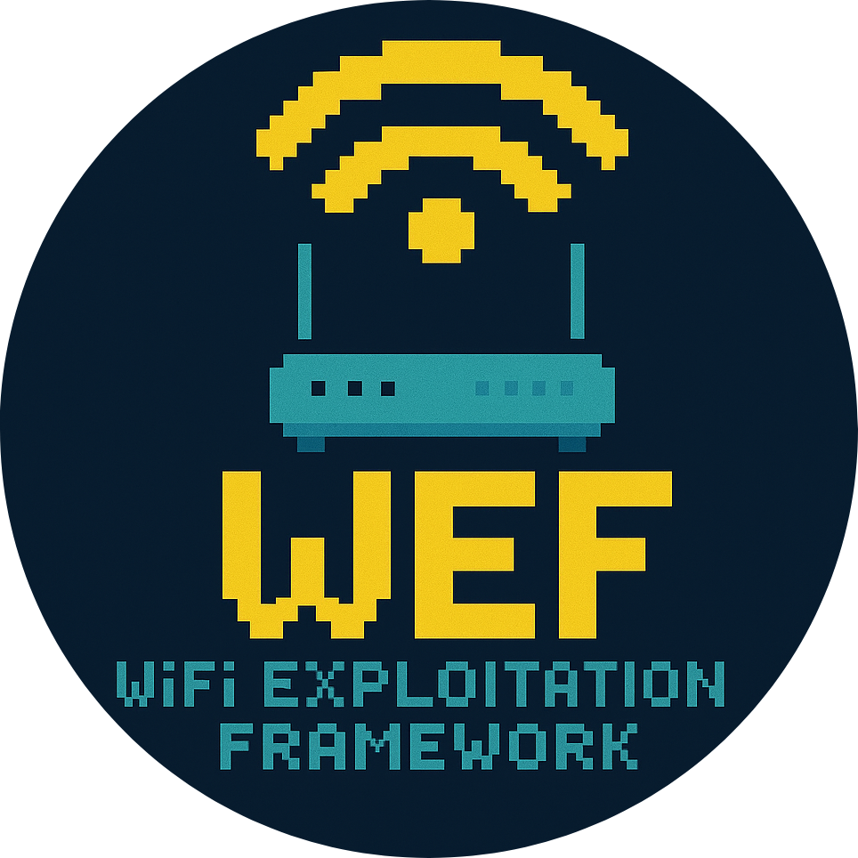

<div align="center">
  
</div>

<p align="center">
  <h4 align="center">WiFi Exploitation Framework</h4>
  <h6 align="center">Coded with 💙 by D3Ext</h6>
</p>

<p align="center">

  <a href="https://opensource.org/licenses/MIT">
    
  </a>

  <a href="https://github.com/D3Ext/D3Ext/blob/main/CHANGELOG.md">
    
  </a>

  <a href="https://github.com/D3Ext/WEF/issues">
    
  </a>

</p>

<p align="center">
  <a href="#introduction">Introduction</a> •
  <a href="#supported-attacks">Attacks</a> •
  <a href="#features">Features</a> •
  <a href="#installation">Installation</a> •
  <a href="#Usage">Usage</a>
</p></br>

<p align="center">
  <a href="SPANISH.md">README in spanish</a>
</p>

## Introduction

This tool is designed for security researchers and penetration testers to analyze and exploit vulnerabilities in Wi-Fi networks. It provides an intuitive interface with a wide range of automated and manual attack techniques to test WPA/WPA2, WPS, and WEP security. With support for both 2.4 GHz and 5 GHz networks, detailed logging and customizable attack options, it offers flexibility for different testing scenarios. This is not a professional tool.

If you find an error, please open an issue (you can write it in english or spanish, as you want).

## Supported attacks

- DoS (optional handshake capture):
    - Deauthentication attack
    - WIDS Confusion attack
    - Authentication attack
    - Beacon Flood attack
    - TKIP attack (Michael Shutdown Exploitation)
- WPS:
    - Pixie Dust attack
    - PIN Bruteforce attack
    - Null Pin attack
- WEP:
    - ARP Replay attack
    - HIRTE attack
    - Caffe Latte attack
    - Fake Authentication attack
- Handshake:
    - WPA handshake capture (without deauth)
    - PMKID attack (clientless)
    - Pwnagotchi mode
- Rogue AP:
    - Evil Twin attack
        - BSSID spoofing
        - Karma mode
        - Enterprise WPA supported
        - Deauth supported
- Other attacks:
    - Automatic attack mode (Auto PWN)
    - WPA3 dictionary attack

All the mentioned attacks/techniques are explained [here](https://github.com/D3Ext/WEF/wiki/Attacks) on the Wiki

## Features

This are some of the most notable features:

:ballot_box_with_check: WPA/WPA2, WPS, WEP, Rogue-AP, and Handshake Attacks

:ballot_box_with_check: Automatic attack mode based on the features of the AP

:ballot_box_with_check: Automatic handshake capture

:ballot_box_with_check: Online and offline handshake cracking

:ballot_box_with_check: Simple login template for Evil Twin attack (different languages)

:ballot_box_with_check: Enable/disable monitor mode and view information about the network interface (frequencies, chipset, MAC...)

:ballot_box_with_check: 2.4 GHz and 5 GHz supported

:ballot_box_with_check: Informative reports using HTML templates

:ballot_box_with_check: English and spanish supported

## Installation

> As root
```sh
git clone --depth 1 https://github.com/D3Ext/WEF
cd WEF
bash wef
```

Take a look at the [Wiki](https://github.com/D3Ext/WEF/wiki/Installation) where I have more info about the installation

## Uninstallation

Simply execute this:

```sh
rm -rf /usr/share/wef \
  /usr/bin/wef
```

## Usage

> Common usage of the framework (your interface may have other name)
```sh
wef -i wlan0
```

> Help panel
```
 __      _____ ___
 \ \    / / __| __|
  \ \/\/ /| _|| _|
   \_/\_/ |___|_|

[WEF] WiFi Exploitation Framework 1.5

[*] Interfaces:
    wlan0
    ens33

Required parameters:
    -i, --interface)    The name of your network adapter interface in managed mode

Optional parameters:
    -h, --help)         Show this help panel
    --version)          Print the version and exit
```

See [here](https://github.com/D3Ext/WEF/wiki/Usage-&-Tips) for more information about how to use the tool and other related topics

## Demo


## TODO

- ~~Online cracking (WPA-SEC)~~
- ~~WPA3 dictionary attack~~
- ~~Enhanced reports using HTML~~
- ~~Modify regulatory domain to change txpower~~
- ~~More languages added as Evil Twin templates~~
- ~~Randomize MAC address automatically during launch~~
- ~~General improvement and minor fixes~~
- ~~Bugs fixed~~
- ~~Auto-exploit mode~~
- ~~APs scan now shows if WPS is enabled without wash~~
- ~~Path autocompletion supported~~
- ~~Better output logging~~
- ~~Better code readability (code optimized)~~
- ~~Add vendor logo to Evil Twin templates on the fly~~
- ~~MAC vendors have been updated and optimized using official OUI list~~
- Test compatibility with others OS
- ~~In-depth testing of implemented features~~

## Contributing

See [CONTRIBUTING.md](https://github.com/D3Ext/WEF/blob/main/CONTRIBUTING.md)

## Changelog

See [CHANGELOG.md](https://github.com/D3Ext/WEF/blob/main/CHANGELOG.md)

## Credits

Thanks to [ultrazar](https://github.com/ultrazar) and [ErKbModifier](https://github.com/ErKbModifier)

## References

```
https://github.com/aircrack-ng/aircrack-ng
https://github.com/aircrack-ng/mdk4
https://github.com/v1s1t0r1sh3r3/airgeddon
https://github.com/FluxionNetwork/fluxion
https://github.com/P0cL4bs/wifipumpkin3
https://github.com/s0lst1c3/eaphammer
https://github.com/derv82/wifite2
https://github.com/wifiphisher/wifiphisher
https://github.com/ZerBea/hcxtools
https://github.com/ZerBea/hcxdumptool
https://github.com/Tylous/SniffAir
https://github.com/blunderbuss-wctf/wacker
https://github.com/evilsocket/pwnagotchi
https://github.com/koutto/pi-pwnbox-rogueap
https://github.com/koutto/pi-pwnbox-rogueap/wiki/01.-WiFi-Basics
```

## Disclaimer

The creator has no responsibility for any kind of illegal use of the project.

## License

This project is under MIT license

Copyright © 2025, *D3Ext*


